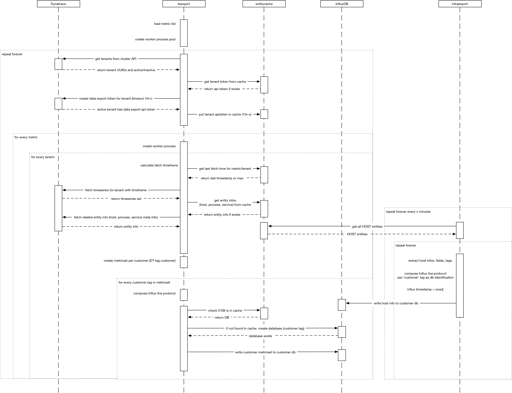

### Dynatrace Managed Time Series Export
Dynatrace Managed provides the ability to export or pull timeseries (metrics) that OneAgent captures from all monitored entities.
This can and will be used to feed infrastructure and performancemetrics into other systems (e.g. InfluxDb/Grafana, HANA DB) for long term storage and analysis that can not be done in Dynatrace itself, or to provide metrics to personas that do not have access to Dynatrace UI.

To learn more on how timeseries are available through API and which timeseries are available out of the box see:
[Dynatrace API Documentation](https://www.dynatrace.com/support/help/dynatrace-api/timeseries/how-do-i-fetch-the-metrics-of-monitored-entities/#available-timeseries)

#### DT Export Stack
This stack consists of multiple docker containers with different functionality:
 
  * tsexport: fetches timeseries and pushes data to influxdb
  * infraexport: translates host entity information into timeseries for influxdb
  * entitycache: used as a cache and volatile storage for entity model and other information for performance reasons

#### Architecture/Flow Diagram

#### Usage

 1. edit the parameters in dtproperties.env
 1. edit metrics.conf to add the metrics you want to fetch, also add aggregation
 1. run docker-compose build
 1. run docker-compose up -d
 1. run docker logs -f tsexport | infraexport